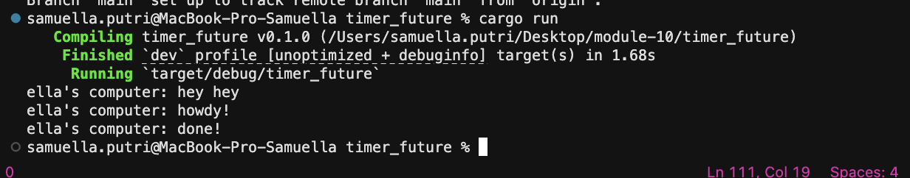
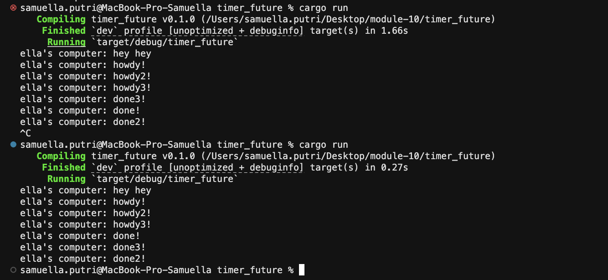

# MODULE 10 TIMER ADVPROG - SAMUELLA PUTRI NADIA PAUNTU (2306170446)

## Understanding How It Works

When adding a println! statement right after the spawner.spawn(...) line, we're writing a synchronous line of code that runs immediately. This is different from the code inside the async block passed to spawn, which only gets scheduled to run later by the executor. The spawn function doesn't start the task right away; it just queues it up. So, the new print statement (like println!("ella's computer: hey hey")) will execute right after spawn(...), even though the actual contents of the async block — such as println!("ella's computer: howdy!") and the 2-second timer — haven't run yet.
The async task only begins execution when the executor is started using executor.run(). At that point, the task will print "howdy!", wait for two seconds using TimerFuture::new(...), and then print "ella's computer: done!". Because the added print line is outside the async block and runs before the executor starts, it appears earlier in the program's output. This shows the difference between synchronous and asynchronous code execution.

## Multiple Spawn and Removing Drop

When I remove drop(spawner); from the code, the executor doesn't know that all the tasks have been sent. So, even after running the existing tasks, it keeps waiting, thinking that more tasks might still be added. This causes the program to hang at the end, and we need to manually stop it by exiting. When I put back drop(spawner);, it tells the executor that no more tasks will come. Now, once the executor finishes running all current tasks, it exits cleanly. We'll see that all the messages like "ella's computer: howdy!" and "ella's computer: done!" are printed, and then the program ends on its own. This shows that drop(spawner); is important because it signals the end of task submission. Without it, the executor waits forever. So the behavior of the console changes depending on whether that line is included or not.